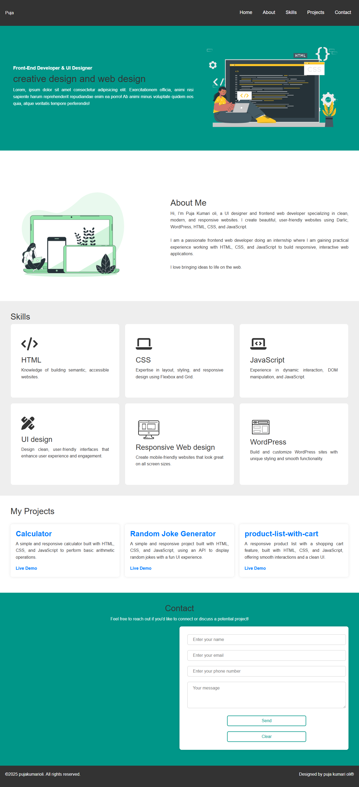

# Portfolio Projects

Welcome to my portfolio! This is a collection of front-end web development projects showcasing my skills in HTML, CSS, JavaScript, and UI design.

## Table of Contents
- [About Me](#about-me)
- [Skills](#skills)
- [Projects](#projects)
- [Contact](#contact)

## Screenshots
Screenshots of my portfolio:

## About Me

Hi, I’m Puja Kumari Oli, a passionate UI designer and front-end web developer. I specialize in building responsive, user-friendly websites using HTML, CSS, JavaScript, and WordPress. 

I enjoy bringing creative designs to life on the web, and I'm currently gaining hands-on experience through an internship. 

## Skills

- **HTML**: Building semantic and accessible websites.
- **CSS**: Responsive layout and styling with Flexbox and Grid.
- **JavaScript**: Interactive web applications, DOM manipulation.
- **UI Design**: Creating user-friendly interfaces.
- **WordPress**: Building and customizing WordPress sites.

## Projects

Here are a few projects I've worked on:

1. **[Calculator](Calculator.html)**  
   A simple and responsive calculator built with HTML, CSS, and JavaScript.

2. **[Random Joke Generator](joke-generator-project/index.html)**  
   A fun and interactive project that generates random jokes using an API.

3. **[Product List with Cart](https://puja-oli.github.io/product-cart-items/)**  
   A responsive product list with a shopping cart built with HTML, CSS, and JavaScript.

